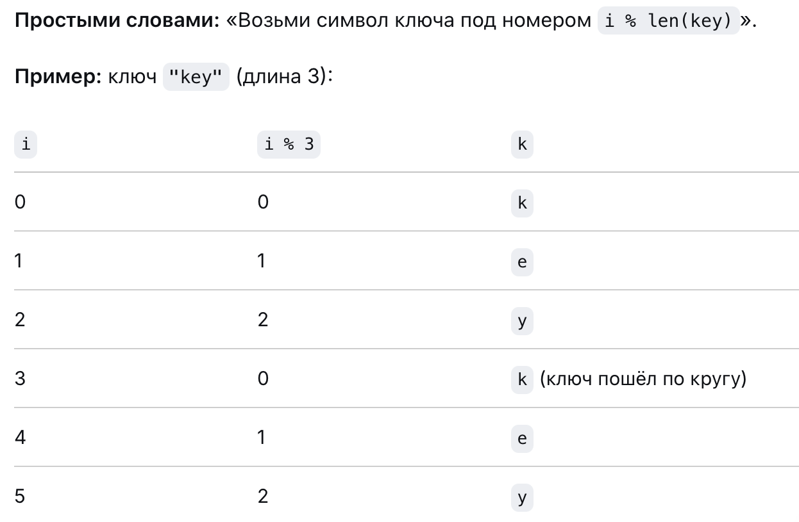
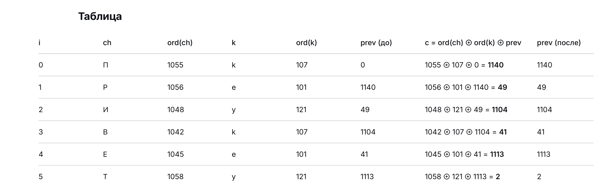
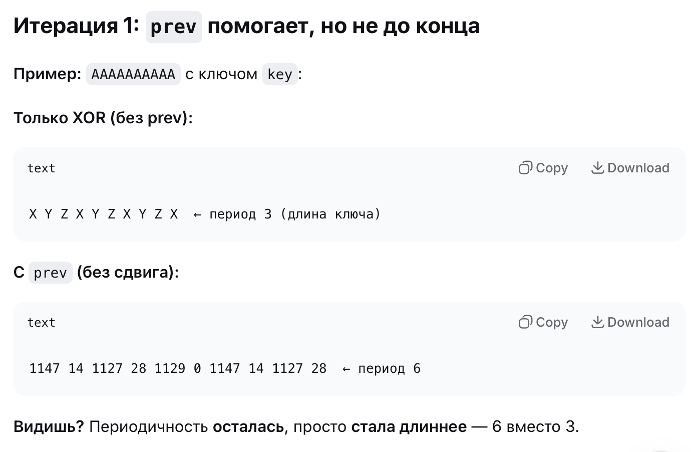

Мой алгоритм — это поточный шифр на основе гаммирования с обратной связью и циклическим сдвигом.

XOR-гаммирование с обратной связью (CFB) + перемешивание битов.

Что это значит:

Поточный — шифрует символ за символом (не блоками);
Гаммирование — накладываем ключ через XOR;
С обратной связью — каждый следующий символ зависит от предыдущего (prev);
Циклический сдвиг — дополнительное перемешивание битов для того чтоб убрать статистические закономерности.

---

--- 

Без prev появляется периодичность.

Сдвиг — нелинейная операция. Он переставляет биты внутри числа.